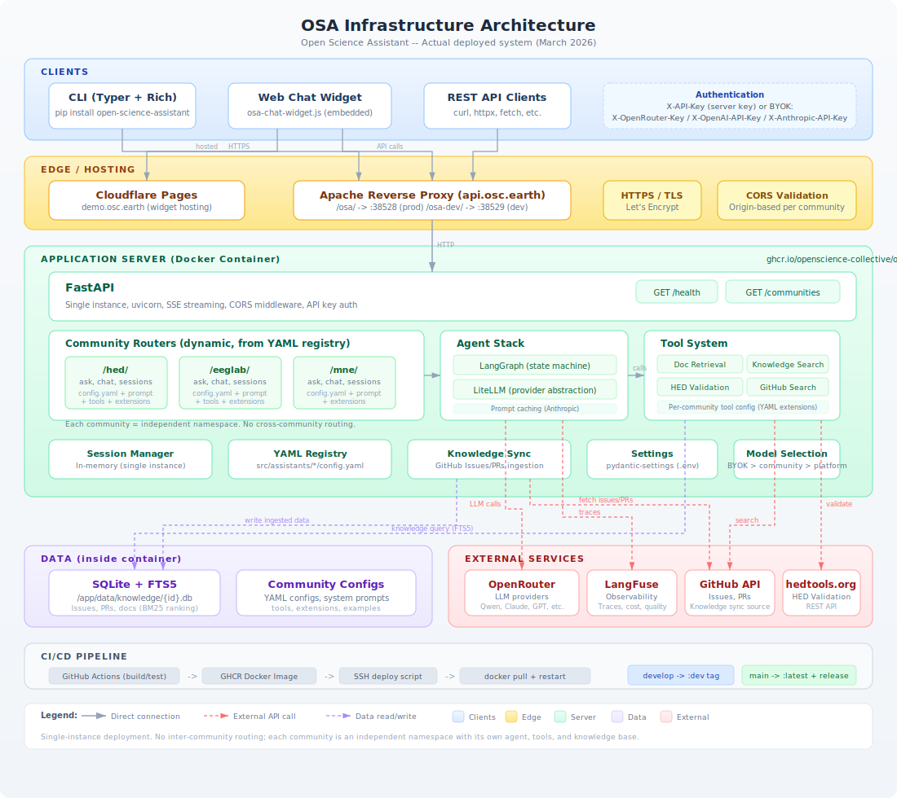

# Architecture Details

This page shows the internal structure of the OSA platform, including all components, data flows, and external service connections.

<figure markdown="span">
  { width="100%" }
  <figcaption>Detailed infrastructure diagram showing all components and data flows</figcaption>
</figure>

---

## Request Flow

A typical request flows through the system as follows:

1. **Client** (CLI, widget, or API consumer) sends an HTTPS request to `api.osc.earth`
2. **Apache reverse proxy** strips the `/osa/` prefix and forwards to the Docker container
3. **FastAPI** validates authentication (API key or BYOK headers) and CORS origin
4. **Community router** (e.g., `/hed/ask`) handles the request using the community's configuration
5. **LangGraph agent** runs the conversation loop:
    - Sends messages to the LLM via **LiteLLM** (through OpenRouter)
    - LLM may request **tool calls** (document retrieval, knowledge search, validation)
    - Tools query **SQLite + FTS5** databases or external APIs (GitHub, hedtools.org)
    - Loop continues until the agent produces a final response
6. **Response** is streamed back to the client via SSE (Server-Sent Events)
7. **LangFuse** records the trace for observability

---

## Community Routing

Routes are created dynamically at startup from the YAML registry:

```python
# src/api/main.py - simplified
for community in registry.list_available():
    router = create_community_router(community.id)
    app.include_router(router)  # Creates /{community_id}/ask, /chat, etc.
```

Each community gets four endpoints:

| Endpoint | Method | Purpose |
|----------|--------|---------|
| `/{id}/` | GET | Community configuration (public) |
| `/{id}/ask` | POST | Single question (no history) |
| `/{id}/chat` | POST | Multi-turn conversation with session |
| `/{id}/sessions` | GET | List active sessions |

---

## Model Selection

Model selection follows a priority chain:

```
User requests custom model (requires BYOK)
    |
    v  (no custom model)
Community default_model (from config.yaml)
    |
    v  (no community override)
Platform default_model (from settings)
```

This allows communities to choose their preferred model while giving users with BYOK the freedom to use any model.

---

## Knowledge System

Each community has its own SQLite database with FTS5 full-text search:

```
/app/data/knowledge/
    hed.db       - HED issues, PRs, documentation
    eeglab.db    - EEGLAB issues, PRs, documentation
    mne.db       - MNE issues, PRs, documentation
```

Knowledge is synced from GitHub via the `osa sync` CLI command, which fetches issues and PRs and indexes them for full-text search with BM25 ranking.

### Why SQLite + FTS5?

For single-instance lab deployment, SQLite with FTS5 is the optimal choice:

| Approach | Search Speed | Dependencies | Use Case |
|----------|-------------|--------------|----------|
| JSON files | O(n) linear | None | Tiny datasets (<1K) |
| **SQLite + FTS5** | **O(log n) indexed** | **None (stdlib)** | **Single instance, 10K-1M records** |
| PostgreSQL | O(log n) indexed | External server | Multi-instance |

Advantages: no external server, BM25 ranking, 100-1000x faster than linear scan, Python stdlib, easy backup (copy the file).

---

## Security Layers

| Layer | Protects Against | Location |
|-------|-----------------|----------|
| HTTPS / TLS | Man-in-the-middle | Let's Encrypt via Apache |
| API Key auth | Unauthorized access | FastAPI middleware |
| CORS validation | Cross-origin attacks | FastAPI middleware (per-community origins) |
| BYOK isolation | Key exposure | Keys forwarded, never stored |

---

## CI/CD Pipeline

```
GitHub Actions (build/test)
    -> GHCR Docker Image (:dev or :latest)
    -> SSH deploy script
    -> docker pull + restart on lab server
```

| Branch | Docker Tag | Deployment |
|--------|-----------|------------|
| `develop` | `:dev` | `api.osc.earth/osa-dev` (port 38529) |
| `main` | `:latest` + GitHub Release | `api.osc.earth/osa` (port 38528) |
