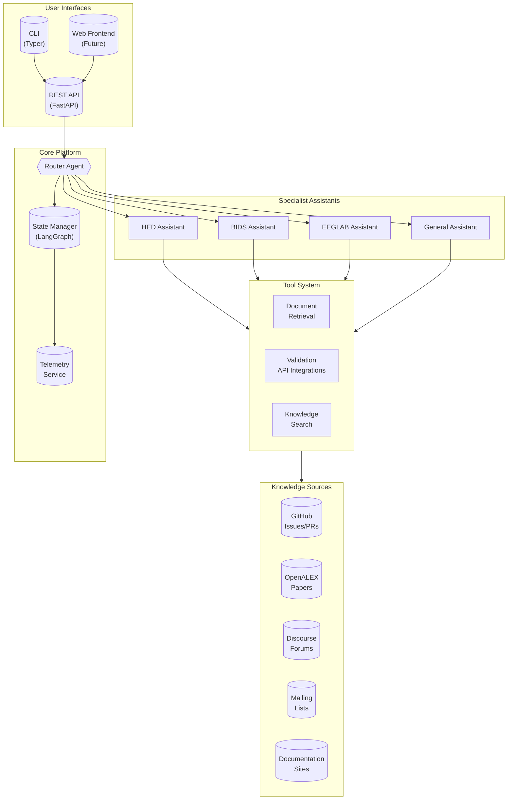
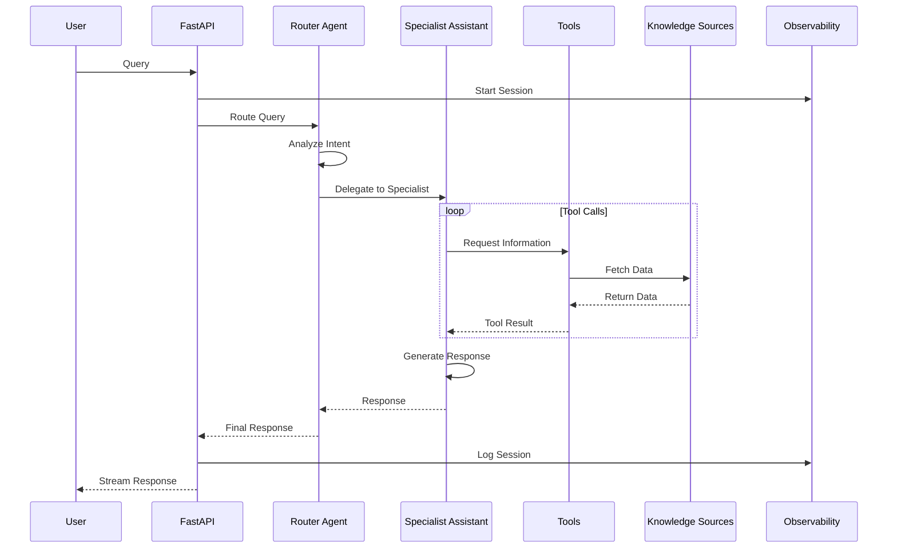

# Architecture

This document describes the system architecture of OSA with diagrams suitable for documentation and publications.

## System Overview



## Request Flow



## Project Structure

```
src/
├── api/                    # FastAPI backend
│   ├── main.py            # App entry point, health check
│   ├── config.py          # Settings (pydantic-settings)
│   └── security.py        # API key auth, BYOK
├── cli/                    # Typer CLI
│   ├── main.py            # CLI commands
│   ├── client.py          # HTTP client
│   └── config.py          # User config (~/.config/osa)
├── agents/                 # LangGraph agents
│   ├── state.py           # State definitions
│   └── base.py            # BaseAgent, SimpleAgent, ToolAgent
├── core/services/          # Business logic
│   └── llm.py             # LLM provider abstraction
└── tools/                  # Document retrieval tools
```

## Component Summary

| Component | Technology | Purpose |
|-----------|------------|---------|
| API Server | FastAPI | REST API, WebSocket streaming |
| CLI | Typer + Rich | Command-line interface |
| Orchestration | LangGraph | Multi-agent workflows, state management |
| LLM Framework | LangChain | Model abstraction, tool calling |
| Observability | LangFuse | Tracing, cost tracking, prompt management |
| Knowledge DB | SQLite + FTS5 | Issues, PRs, papers with full-text search |
| Session State | In-memory / SQLite | Single instance, simple persistence |

## Design Decisions

### Why LangGraph?

- Clean state management for multi-turn chat
- Tool calling patterns built-in
- Easy to extend with new assistants

### Why NOT PostgreSQL/Redis/Vector DB?

- Lab-scale deployment doesn't need horizontal scaling
- In-memory state is fine for single server
- Direct document fetching is simpler than RAG for our doc corpus
- Add complexity only when actually needed

### Why SQLite with FTS5?

For single-instance lab deployment, SQLite with FTS5 is optimal:

| Approach | Search Speed | Dependencies | Use Case |
|----------|-------------|--------------|----------|
| JSON files | O(n) linear | None | Tiny datasets (<1K) |
| MongoDB | O(log n) indexed | External server | Multi-instance, large scale |
| **SQLite + FTS5** | O(log n) indexed | None (stdlib) | **Single instance, 10K-1M records** |
| PostgreSQL | O(log n) indexed | External server | Multi-instance, complex queries |

### Why BYOK?

- Researchers may have their own API keys
- Reduces server cost
- User pays for their own usage
