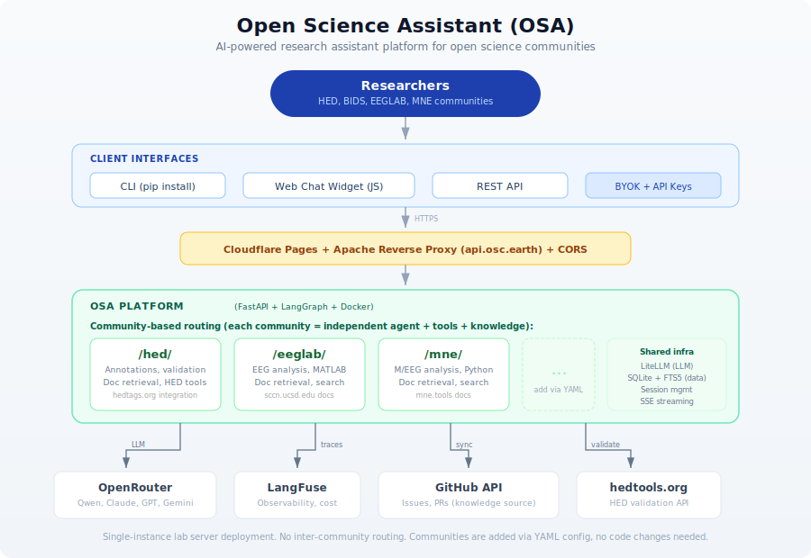

# Architecture Overview

OSA is a single-instance AI assistant platform that serves multiple research communities from one deployment. Each community gets its own independent namespace with a dedicated agent, tools, and knowledge base.

<figure markdown="span">
  { width="100%" }
  <figcaption>High-level view of the OSA platform</figcaption>
</figure>

---

## Key Design Decisions

### Community-based routing, not a supervisor agent

Each community (HED, EEGLAB, MNE, etc.) is an **independent namespace** at the API level:

```
/hed/ask       - Ask the HED assistant
/eeglab/chat   - Chat with the EEGLAB assistant
/mne/ask       - Ask the MNE assistant
```

There is no router or supervisor agent that dispatches queries between communities. The user (or widget) selects a community explicitly, and each community has its own:

- **System prompt** tailored to the domain
- **Tools** configured via YAML extensions
- **Knowledge base** (SQLite + FTS5, synced from GitHub)
- **LangGraph agent** running the conversation loop

### Simple infrastructure

OSA targets small research communities running on lab servers, not large-scale cloud deployments:

| Choice | Why |
|--------|-----|
| **Single FastAPI instance** | No need for horizontal scaling |
| **SQLite + FTS5** | No external database server needed; full-text search with BM25 ranking |
| **In-memory sessions** | Single instance means no shared state needed |
| **Docker** | Reproducible deployment, easy updates |
| **OpenRouter** | Single API for multiple LLM providers (Qwen, Claude, GPT, etc.) |

### Adding a community requires no code changes

Communities are defined entirely in YAML configuration files. Adding a new community means creating a `config.yaml` with the community's identity, system prompt, tools, and knowledge sources. The API routes are generated dynamically at startup.

See the [Community Registry](registry/index.md) documentation for details.

---

## Component Summary

| Component | Technology | Purpose |
|-----------|------------|---------|
| API Server | FastAPI | REST API, SSE streaming |
| CLI | Typer + Rich | Command-line interface (`pip install open-science-assistant`) |
| Agent Orchestration | LangGraph | State machine for conversation + tool-calling loop |
| LLM Abstraction | LiteLLM | Provider routing, prompt caching |
| Knowledge Storage | SQLite + FTS5 | Issues, PRs, docs with full-text search (BM25) |
| Observability | LangFuse | Tracing, cost tracking, quality metrics |
| Deployment | Docker + GitHub Actions | CI/CD to GHCR, deploy via SSH |
| Frontend | Cloudflare Pages | Widget hosting (demo.osc.earth) |
| Reverse Proxy | Apache | api.osc.earth path-based routing |

### External API Integrations

OSA integrates with existing validator and tool APIs rather than hosting validation engines locally:

| Service | Integration |
|---------|-------------|
| [HED Validation](https://hedtools.org/hed) | String, sidecar, spreadsheet, BIDS validation |
| [OpenRouter](https://openrouter.ai) | LLM provider routing (Qwen, Claude, GPT, Gemini) |
| [GitHub API](https://api.github.com) | Knowledge source (issues, PRs) |
| [LangFuse](https://langfuse.com) | Observability and cost tracking |

---

## Authentication

OSA supports two authentication modes:

- **Server API key** (`X-API-Key` header): Uses the server's configured LLM key with the community's default model
- **BYOK (Bring Your Own Key)**: Users provide their own OpenRouter/OpenAI/Anthropic key via headers, allowing them to use any model

---

## Deployment

OSA runs as a Docker container behind an Apache reverse proxy:

| Environment | API URL | Frontend URL |
|-------------|---------|-------------|
| Production | `https://api.osc.earth/osa` | `https://demo.osc.earth` |
| Development | `https://api.osc.earth/osa-dev` | `https://develop-demo.osc.earth` |

CI/CD: GitHub Actions builds Docker images on push, tagged `:dev` (develop branch) or `:latest` (main branch). Deployment is a `docker pull` + restart on the lab server.

---

For the detailed internal architecture, see [Architecture Details](architecture-details.md).
