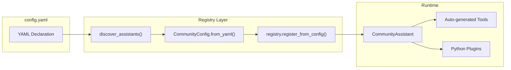

# Community Registry

The Community Registry is OSA's system for declaratively configuring research community assistants using YAML files. Each community gets a dedicated `config.yaml` that defines its documentation sources, system prompt, knowledge sync settings, and specialized tools.

## How It Works



1. **Discovery**: On startup, the registry scans `src/assistants/*/config.yaml` for community configs
2. **Validation**: Each config is parsed and validated against the `CommunityConfig` schema (Pydantic)
3. **Registration**: Valid configs are registered in the global `AssistantRegistry`
4. **Creation**: When a request comes in, the registry creates a `CommunityAssistant` with auto-generated tools

## What YAML Drives

| Aspect | Configuration | Effect |
|--------|---------------|--------|
| Identity | `id`, `name`, `description` | API routing, display name, status |
| System prompt | `system_prompt` | LLM instructions with placeholders |
| Documentation | `documentation` list | Auto-generates `retrieve_docs` tool |
| Knowledge sync | `github.repos`, `citations` | GitHub issues/PRs and paper sync |
| Specialized tools | `extensions.python_plugins` | Loads custom Python tool functions |
| Widget behavior | `enable_page_context` | Adds page context tool for embeds |

## Directory Structure

```
src/assistants/
    registry.py              # Discovery and registration
    community.py             # CommunityAssistant class
    hed/
        config.yaml          # HED community configuration
        tools.py             # HED-specific tools (validation, tag suggestion)
    bids/                    # Future
        config.yaml
        tools.py
```

## Key Principles

**YAML is the single source of truth.** All community configuration lives in `config.yaml`. Python code is only needed for specialized tools that require external API calls or complex logic (e.g., HED string validation).

**Auto-generated tools.** The `retrieve_docs` and knowledge search tools are automatically created from the YAML config. You don't write Python code for documentation retrieval.

**Convention over configuration.** Place your `config.yaml` in `src/assistants/<community-id>/` and the registry discovers it automatically.

## Next Steps

- [Quick Start](quick-start.md) - Add a new community in 5 minutes
- [Schema Reference](schema-reference.md) - Full YAML schema documentation
- [Extensions](extensions.md) - Python plugins and MCP servers
