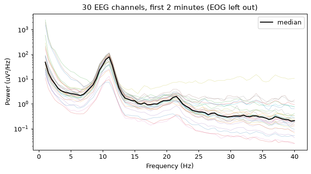
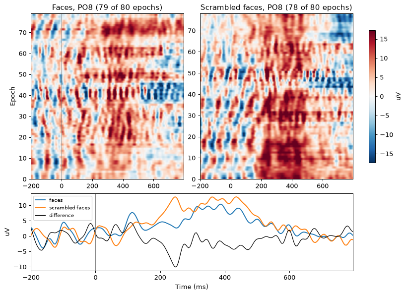

# NEMAR Examples: a Power Spectrum and an Event-Related Potential Image

Two analyses the NEMAR assistant runs for a reader, worked through on ERP CORE (`nm000132`), a set of standard event-related potential (ERP) paradigms:
the power spectrum of a recording's electroencephalography (EEG) channels, and an ERP image of its conditions.
The recording is subject 001's N170 task, which shows faces, cars, scrambled faces and scrambled cars, 80 of each.

The code on this page is what the assistant writes for the chat's browser runtime, which has numpy, matplotlib, zarr and eegprep-lean and nothing else.
For the same analyses with SciPy, in NEMAR's notebook or your own Python, see NEMAR's [worked examples](https://docs.nemar.org/platform/zarr/examples/).

## What to ask

The assistant and its notebook reach [nemar.org](https://nemar.org)'s dataset pages with NEMAR's next release; nemar.org does not embed them yet.
There, on a dataset page, open the assistant and ask, for example:

- "Show the power spectrum of the EEG channels in sub-001's N170 recording from nm000132"
- "Plot an ERP image of faces against scrambled faces at PO8 in sub-001's N170 recording from nm000132"

On a dataset with a Zarr copy, the assistant's suggested questions include both, filled in with that dataset's first recording.
It runs the code in your browser only after you approve it, and reads the recording from NEMAR's Zarr copy, which is lossy and may be downsampled:
this one is 250 Hz, from 1024 Hz.
For a published result, download the Brain Imaging Data Structure (BIDS) files.

## What the assistant does

1. **`nemar_list_recordings`** gives the recording's `path` and its channel group, `eeg_250hz`: 33 channels at 250 Hz, 30 EEG and three electrooculography (EOG).
2. **`nemar_get_events` with `limit: 1`** answers one row and a `columns_summary`, which lists each column with its values when it has few.
   That is where the conditions are: ERP CORE's `trial_type` is only stimulus or response, and its faces and cars are in `event_type`.
3. **`nemar_get_events` again**, asking for only what the code needs:
   `where: {"event_type": ["face", "scrambled_face"]}` and `columns: ["event_type"]`,
   160 rows with an exact `sample_index` at the group's rate, rather than every column of all 640 events.
   A server that predates `where` and `columns` ignores them and answers every row, with no `columns_summary`; the assistant then takes what it needs from those.
4. **`execute_code`** runs one of the scripts below with those values filled in, and the figure comes back to the chat.

## The power spectrum

The first two minutes are enough for a stable spectrum.
Welch's method is written out in numpy, since the chat runtime has no SciPy:
2-second segments overlapping by half, each tapered with a Hann window, their power averaged and scaled to power per hertz.

```python
import eegprep_lean
import matplotlib.pyplot as plt
import numpy as np

index = await eegprep_lean.read_index("nm000132")
store = index.store("sub-001/eeg/sub-001_task-N170_eeg.set")
group = store.group("eeg_250hz")
window = await eegprep_lean.read_window(
    index, store, group=group, start_sample=0, n_samples=int(120 * group.rate)
)
labels = list(window.labels)
eeg = [i for i, name in enumerate(labels) if "EOG" not in name.upper()]

# Welch's method in numpy: 2-second Hann-tapered segments overlapping by half.
rate = window.rate
segment = int(2 * rate)
taper = np.hanning(segment)
x = window.data[eeg] - window.data[eeg].mean(axis=1, keepdims=True)
starts = range(0, x.shape[1] - segment + 1, segment // 2)
power = sum(np.abs(np.fft.rfft(x[:, s : s + segment] * taper, axis=1)) ** 2 for s in starts)
power = power / (len(starts) * rate * np.sum(taper**2))
power[:, 1:-1] *= 2
freqs = np.fft.rfftfreq(segment, 1 / rate)
band = (freqs >= 1) & (freqs <= 40)

fig, ax = plt.subplots(figsize=(8, 4))
ax.semilogy(freqs[band], power[:, band].T, lw=0.5, alpha=0.4)
ax.semilogy(freqs[band], np.median(power[:, band], axis=0), color="k", lw=1.5, label="median")
ax.set(xlabel="Frequency (Hz)", ylabel=f"Power ({window.unit}²/Hz)",
       title=f"{len(eeg)} EEG channels, first 2 minutes (EOG left out)")
ax.legend()
display(fig)
```



The median spectrum peaks at 11 Hz, the alpha rhythm, with a smaller peak near 20 Hz.

## The ERP image

An ERP image is one channel's epochs, stacked as the rows of an image, one panel per condition, with each condition's average below.
The recording is read once, re-referenced to the average of the EEG channels, and low-passed at 30 Hz with a windowed-sinc filter.
Each epoch runs from 200 ms before its event to 800 ms after, has its pre-event mean subtracted, and is dropped if it exceeds 100 µV;
each image row averages five neighboring epochs, so a response that repeats from trial to trial stands out.
The channel is PO8, where the face-specific N170 is usually largest.

```python
import eegprep_lean
import matplotlib.pyplot as plt
import numpy as np

# From nemar_get_events(where={"event_type": ["face", "scrambled_face"]}, columns=["event_type"]):
# each condition's sample_index values, at the group's 250 Hz.
FACE = [5291, 5683, ...]  # 80 values
SCRAMBLED_FACE = [4904, 7195, ...]  # 80 values

index = await eegprep_lean.read_index("nm000132")
store = index.store("sub-001/eeg/sub-001_task-N170_eeg.set")
group = store.group("eeg_250hz")
recording = await eegprep_lean.read_window(
    index, store, group=group, start_sample=0, n_samples=group.n_samples
)
labels = list(recording.labels)
eeg = [i for i, name in enumerate(labels) if "EOG" not in name.upper()]
rate = recording.rate

data = recording.data[eeg].astype(float)
data -= data.mean(axis=0)  # average reference
# A windowed-sinc low-pass at 30 Hz, 0.4 s of taps; "same" keeps it zero-phase.
taps = int(0.4 * rate) // 2 * 2 + 1
kernel = np.sinc(2 * 30 / rate * (np.arange(taps) - taps // 2)) * np.hamming(taps)
po8 = np.convolve(data[[labels[i] for i in eeg].index("PO8")], kernel / kernel.sum(), mode="same")

pre, post = int(0.2 * rate), int(0.8 * rate)
times = np.arange(-pre, post) / rate * 1000


def epochs(samples):
    e = np.stack([po8[s - pre : s + post] for s in samples if s >= pre and s + post <= len(po8)])
    e -= e[:, :pre].mean(axis=1, keepdims=True)
    return e[np.abs(e).max(axis=1) <= 100]


faces, scrambled = epochs(FACE), epochs(SCRAMBLED_FACE)
smooth = lambda e: np.stack([e[max(0, k - 2) : k + 3].mean(axis=0) for k in range(len(e))])
limit = np.percentile(np.abs(np.concatenate([smooth(faces), smooth(scrambled)])), 98)

fig = plt.figure(figsize=(9, 6.5), layout="constrained")
grid = fig.add_gridspec(2, 2, height_ratios=[3, 1.4])
for col, (title, e) in enumerate([("Faces", faces), ("Scrambled faces", scrambled)]):
    ax = fig.add_subplot(grid[0, col])
    image = ax.imshow(smooth(e), aspect="auto", origin="lower", cmap="RdBu_r",
                      vmin=-limit, vmax=limit, extent=[times[0], times[-1], 0, len(e)])
    ax.axvline(0, color="gray", lw=0.8)
    ax.set(title=f"{title}, PO8 ({len(e)} of 80 epochs)", ylabel="Epoch" if col == 0 else None)
fig.colorbar(image, ax=fig.axes, label=recording.unit, shrink=0.8)
average = fig.add_subplot(grid[1, :])
average.plot(times, faces.mean(axis=0), label="faces")
average.plot(times, scrambled.mean(axis=0), label="scrambled faces")
average.plot(times, faces.mean(axis=0) - scrambled.mean(axis=0), color="k", lw=1, label="difference")
average.axvline(0, color="gray", lw=0.8)
average.set(xlabel="Time (ms)", ylabel=recording.unit, xlim=(times[0], times[-1]))
average.legend(fontsize=8, loc="upper left")
display(fig)
w = (times >= 150) & (times <= 260)
print(f"150-260 ms at PO8: faces minus scrambled faces {faces[:, w].mean() - scrambled[:, w].mean():.1f} {recording.unit}")
```



```text
150-260 ms at PO8: faces minus scrambled faces -4.2 uV
```

Faces are more negative than scrambled faces from about 150 ms, most of all near 250 ms,
later in this subject than the textbook 170 ms; the assistant is told to report what the data show, not the textbook latency.
One subject from a downsampled copy is a first look, not a result.

## Other datasets

Nothing here is specific to ERP CORE except the values: the recording, the column that names the conditions, the conditions, and the channel.
The assistant finds the first three from the tools, and asks for the channel when the dataset does not say which one the component is measured at.
How it is taught to do this is the "Spectra, events and ERP images" section of NEMAR's system prompt, in the community's [`config.yaml`](https://github.com/OpenScience-Collective/osa/blob/develop/src/assistants/nemar/config.yaml).
